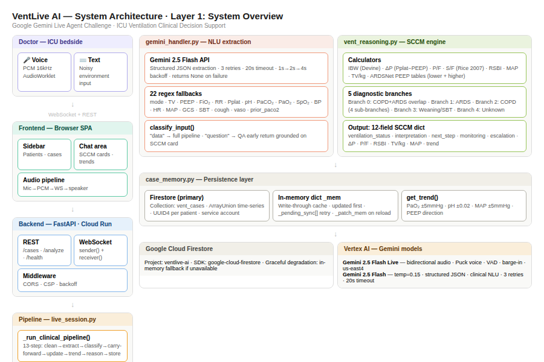
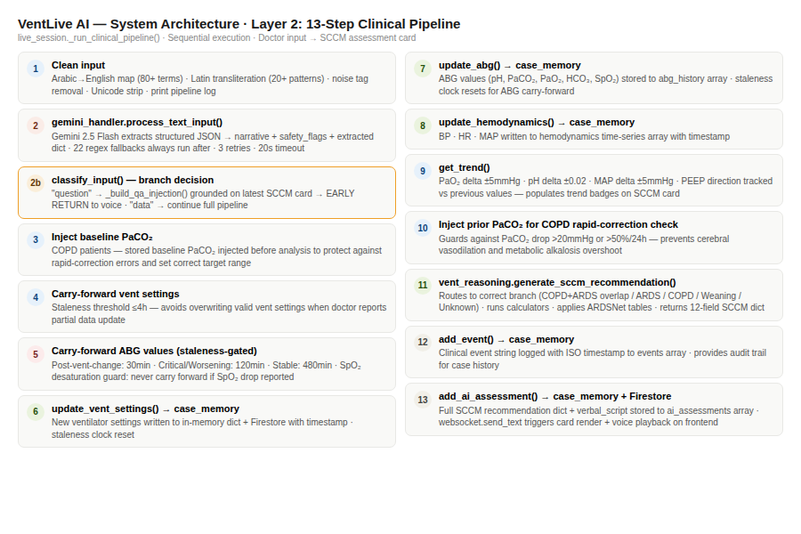
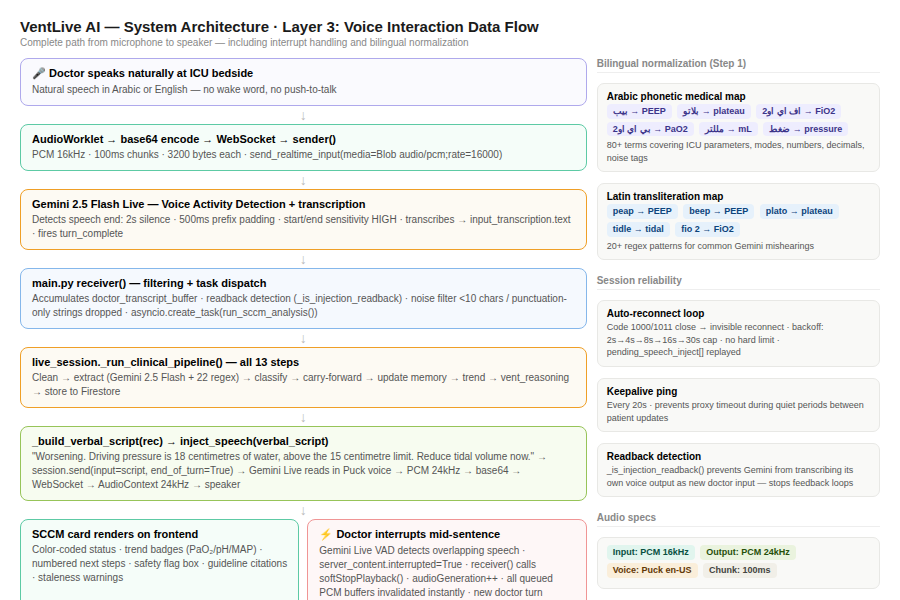
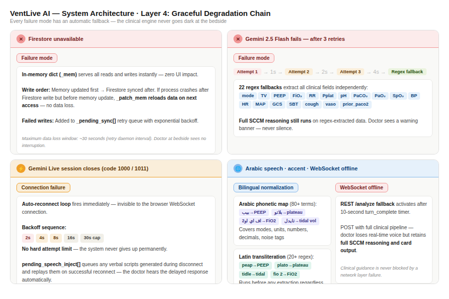

# VentLive AI
### Real-Time Voice AI Clinical Decision Support for ICU Mechanical Ventilation

> Speak naturally at the bedside. Hear a complete, evidence-based ventilation
> assessment in seconds. Powered by Gemini Live 2.5 Flash Native Audio on
> Vertex AI.

Built for the **[Gemini Live Agent Challenge](https://geminiliveagentchallenge.devpost.com/)** · Live Agent category
*Designed by a physician, for physicians.*

---

## 🔗 Live Demo
**[https://ventassist-dev.github.io/ventlive-ai/index.html](https://ventassist-dev.github.io/ventlive-ai/index.html)**


## 📺 Demo Video
**[YouTube — VentLive AI Demo](https://youtu.be/ZSB2BdnKjZ4)**


---

## 🧪 Reproducible Testing

The fastest way to verify VentLive AI is running:
```bash
# 1. Health check — confirms backend is live on Google Cloud
curl https://ventlive-ai-270502917056.us-central1.run.app/health

# Expected response:
# {"status":"ok","service":"VentLive AI v4.0",
#  "model":"gemini-live-2.5-flash-native-audio",
#  "platform":"Vertex AI","storage":{"backend":"firestore",...}}

# 2. Open the frontend
# https://ventassist-dev.github.io/ventlive-ai/index.html
```

For full local setup and Cloud Run deployment instructions
see [Spin-Up Instructions](#spin-up-instructions) below.

---

## Table of Contents

1. [The Problem](#the-problem)
2. [What It Does](#what-it-does)
3. [Features](#features)
4. [Technologies Used](#technologies-used)
5. [Third-Party Integrations](#third-party-integrations)
6. [Architecture Diagram](#architecture-diagram)
7. [Google Cloud Deployment Proof](#google-cloud-deployment-proof)
8. [Spin-Up Instructions](#spin-up-instructions)
   - [Prerequisites](#prerequisites)
   - [Local Development](#local-development)
   - [Cloud Deployment](#cloud-deployment)
   - [Automated Deployment](#automated-deployment)
9. [Project Structure](#project-structure)
10. [Findings & Learnings](#findings--learnings)
11. [What's Next](#whats-next)
12. [Clinical Disclaimer](#clinical-disclaimer)
13. [About](#about)
14. [License](#license)

---

## 🩺 The Problem

At 4 AM in an understaffed ICU, a junior physician stands alone in front of
a ventilator managing a critically ill patient they were never properly
trained to ventilate. Nearly **50% of trainees report dissatisfaction with
their MV education**, and real-world data shows that **40% of ICU patients
receive tidal volumes above the safe limit** — with those exposed for over
24 hours facing **82% higher odds of in-hospital death**. A 2025 review
confirmed that failing to minimize driving pressure below 15 cmH₂O from
the onset of ventilation independently increases 30-day mortality — yet
this single bedside calculation is routinely skipped.

The knowledge was never the problem. Delivery, timing, and format were.

**VentLive AI is the tool that should have been there.**

---

## What It Does

VentLive AI is a real-time, voice-interactive clinical decision support agent
for ICU physicians managing mechanically ventilated patients.

A physician speaks naturally at the bedside — or types in noisy environments —
and VentLive AI responds immediately with a fully structured, evidence-based
assessment covering five clinical scenarios:

- **ARDS** (Acute Respiratory Distress Syndrome)
- **COPD** (Chronic Obstructive Pulmonary Disease / Hypercapnic Respiratory Failure)
- **COPD + ARDS Overlap** (conflicting PEEP goals resolved simultaneously)
- **Weaning and Liberation** (SBT readiness, SBT failure management,
  extubation criteria)
- **Post-Operative Weaning** (rapid, safe extubation pathway)

Two Gemini models work in tandem with strictly separated roles.
**Gemini Live 2.5 Flash Native Audio** handles real-time bidirectional voice:
receiving physician speech as a continuous audio stream, managing natural
turn-taking, and delivering spoken assessments. It operates under a hard
constraint — it never generates clinical content from its own knowledge.
Every word it speaks is verified text injected from the reasoning engine
after the full assessment is complete.
**Gemini 2.5 Flash** handles clinical extraction: parsing structured
ventilator parameters, ABG values, hemodynamics, and weaning indicators
from natural speech — including voice recognition artifacts and mixed
Arabic/English ICU terminology. When the Gemini extraction API is
unavailable, 22 purpose-built regex extractors activate automatically
and the full reasoning engine continues. The system never goes silent.

This architecture enforces a deliberate sequence: the complete evidence-based
clinical assessment finishes first, then the result is injected as spoken
text. The physician hears a complete, structured answer every time —
never a half-formed one generated mid-reasoning.

---

## Features

### Voice Interface
- **Always-on microphone** — no push-to-talk required
- **Natural interruption** — doctor can barge in mid-sentence; Gemini Live
  detects overlapping speech server-side and stops immediately
- **Mute toggle** — freezes mic audio while keeping session alive
- **Automatic session reconnect** — Gemini Live sessions close after each
  turn (code 1000/1011); the server reconnects silently without the
  browser WebSocket ever dropping
- **Bilingual Arabic/English normalization** — 80+ Arabic phonetic medical
  term mappings + 20+ Latin transliteration patterns for common
  speech-to-text errors (e.g. "peap" → PEEP, "plato" → plateau,
  "بيب" → PEEP, "بلاتو" → plateau)

### Clinical Extraction
- Extracts 22 structured clinical fields from free-form speech:
  ventilator mode, TV, PEEP, FiO₂, RR, Pplat, Ppeak, auto-PEEP,
  inspiratory flow, pH, PaCO₂, PaO₂, HCO₃, SpO₂, BP, HR, MAP, GCS,
  cough strength, SBT status, vasopressor dose, baseline PaCO₂, prior PaCO₂
- Handles Arabic/English mixed input, voice recognition artifacts,
  noise tags (`<noise>`, `[inaudible]`), and speech-to-text errors
- Gemini 2.5 Flash primary extraction with 3-retry / 20-second timeout
  and exponential backoff (1s → 2s → 4s)
- 22 regex fallbacks activate automatically on Gemini failure —
  full SCCM reasoning continues with warning banner

### Real-Time Metric Calculation

| Metric | Formula | Clinical Target |
|---|---|---|
| Driving Pressure | ΔP = Pplat − PEEP | ≤ 15 cmH₂O |
| P/F Ratio | PaO₂ / FiO₂ | ARDS severity classification |
| S/F Ratio | SpO₂ / FiO₂ | Non-invasive ARDS surrogate (Rice 2007) |
| TV/IBW | TV (mL) / IBW (kg) | 6 mL/kg ARDSNet target |
| RSBI | RR / TV (L) | < 105 for weaning readiness |
| MAP | (SBP + 2×DBP) / 3 | Hemodynamic stability |

- **Driving Pressure** — tiered danger thresholds at ≥13, ≥15, ≥20 cmH₂O
- **P/F Ratio** — Berlin ARDS severity with prone and ECMO thresholds
- **S/F Ratio** — Rice 2007 surrogate when ABG unavailable (SpO₂ ≤ 97% gate)
- **TV/IBW** — Devine formula IBW with ARDSNet minimum floors
- **RSBI** — displayed for weaning assessments only
- **MAP** — calculated from systolic/diastolic when not directly reported

### SCCM Assessment Card
- **Color-coded severity** — 🟢 green (Stable), 🟠 orange (Worsening),
  🔴 red (Critical)
- **Numbered, color-coded next steps** — red for critical, amber for
  warnings, green for standard
- **Safety flags** — rendered only when clinically meaningful; absent when
  no concerns exist (no alarm fatigue)
- **Trend badges** — PaO₂, pH, MAP, PEEP direction from second assessment
  onward
- **Context-aware staleness detection** — 30 min post-vent-change,
  2 h for Critical/Worsening, 8 h for Stable; alerts physician when ABG
  values are stale after new vent settings are reported
- **ARDSNet PEEP/FiO₂ table** — Lower and Higher PEEP tables
  cross-referenced automatically; ATS/ESICM divergence flagged inline
- **Guideline citations** — every recommendation carries its source inline
  (ATS 2024, ESICM 2023, GOLD 2024, PROSEVA, EOLIA, etc.)
- **Smart Q&A** — follow-up questions answered from the last verified SCCM
  card without generating a new assessment card; grounded strictly on
  verified patient data to prevent hallucination
- **Smart rendering** — card only appears after first assessment; updates
  only when new clinical data is provided

### Clinical Safety Guards
- Negation-aware SBT parsing (`_is_negated()` with 50-char window,
  20+ negation patterns) — "was not tolerated" never triggers pass path
- Full-support guard — prevents numeric deterioration signals from being
  misread as SBT failure when patient is on full ventilatory support
- COPD over-correction guard — PaCO₂ drop > 20 mmHg or > 50% within
  24 h triggers intracranial haemorrhage risk warning (GOLD 2024)
- COPD baseline PaCO₂ protection — warns before correcting below
  patient's chronic baseline. VentLive AI stores each COPD patient's chronic baseline PaCO₂ at admission, monitors every subsequent ABG against that individual floor rather than the textbook normal, and alerts the physician in real time if mechanical ventilation is correcting CO₂ faster or further than the patient's physiology can safely tolerate, preventing the post-hypercapnic metabolic alkalosis, cerebral vasoconstriction, and ventilator dependency that over-correction reliably produces
- SpO₂ desaturation guard — never carries forward old SpO₂ if a drop
  is reported in the same input
- ARDS/COPD overlap priority logic — oxygenation-first when P/F < 150,
  hyperinflation-first when auto-PEEP detected; mandatory escalation
  flags active for both conditions simultaneously

### Patient Management
- Create up to 50 patients per Firestore collection (configurable)
- Persistent case history — vent settings, ABGs, hemodynamics, events,
  AI assessments, SBT attempts
- Paginated patient list (10 per page)
- Baseline PaCO₂ stored per patient for COPD carry-forward
- Session history restored on patient re-selection

### Resilience
- Firestore unavailable → in-memory dict fallback (automatic, silent)
- Gemini Flash fails → 22 regex extractors → full SCCM reasoning continues
- Gemini Live closes → reconnect loop (exponential backoff, no hard cap)
- WebSocket offline → REST `/analyze` fallback with 10-second timer

### Responsive Design
- 5 breakpoints: desktop (≥1024px) through very small phone (<360px)
- Android Chrome 100vh fix (dynamic toolbar)
- iOS AudioContext unlock (silent buffer on first user gesture)
- Safe-area inset support for notched devices

---

## Technologies Used

| Category | Technology |
|---|---|
| **Backend language** | Python 3.11 |
| **Frontend** | JavaScript (ES6+), HTML5, CSS3 — single-file SPA, no build tools |
| **Web framework** | FastAPI + Uvicorn (ASGI) |
| **Data validation** | Pydantic |
| **Cloud platform** | Google Cloud Platform |
| **AI — voice I/O** | Gemini Live 2.5 Flash Native Audio (Vertex AI) |
| **AI — NLU extraction** | Gemini 2.5 Flash (Google GenAI API) |
| **AI SDK** | Google GenAI Python SDK (`google-genai`) |
| **Database** | Google Cloud Firestore (+ in-memory dict fallback) |
| **Hosting** | Google Cloud Run |
| **Real-time comms** | WebSocket (FastAPI native) |
| **Audio capture** | Web Audio API, AudioWorklet (16kHz PCM) |
| **Audio playback** | Web Audio API, AudioContext (24kHz PCM) |
| **Auth** | API Key (X-API-Key header / query param for WebSocket) |
| **Dev environment** | Google Colab (single-cell architecture) |
| **Dev tunnel** | ngrok (HTTPS reverse proxy for local development) |
| **Clinical logic** | Pure Python deterministic rule engine (no external calls) |

---

## Third-Party Integrations

### Google Gemini — Gemini Live 2.5 Flash Native Audio
- **Provider:** Google Cloud / Vertex AI
- **Purpose:** Real-time bidirectional voice streaming, speech-to-text
  transcription, text-to-speech output (Puck voice, en-US), server-side
  voice activity detection, natural interruption (barge-in)
- **SDK:** `google-genai` Python SDK — `client.aio.live.connect()`
- **Model string:** `gemini-live-2.5-flash-native-audio`
- **Authentication:** Vertex AI service account (GCP_PROJECT env var)
- **Configuration:** LiveConnectConfig with AudioTranscriptionConfig,
  RealtimeInputConfig, SpeechConfig, AutomaticActivityDetection

### Google Gemini — Gemini 2.5 Flash (Text)
- **Provider:** Google AI / Vertex AI
- **Purpose:** Clinical NLU — extracting structured ventilator parameters,
  ABG values, hemodynamics, and weaning indicators from free-form physician
  speech transcripts; generating clinical narratives and safety flags
- **SDK:** `google-genai` Python SDK — `client.aio.models.generate_content()`
- **Model string:** `gemini-2.5-flash`
- **Authentication:** GEMINI_API_KEY env var (or Vertex AI project fallback)
- **Call pattern:** 3 retries, 20-second asyncio timeout per attempt,
  exponential backoff 1s → 2s → 4s; returns None on total failure
  triggering regex-only fallback mode

### Google Cloud Firestore
- **Provider:** Google Cloud Platform
- **Purpose:** Persistent patient case storage — ventilator settings history,
  ABG history, hemodynamics, clinical events, AI assessments, SBT attempts
- **SDK:** `google-cloud-firestore` Python SDK
- **Collection:** `vent_cases` (one document per patient, UUID4 key)
- **Write pattern:** ArrayUnion for append-only time-series fields;
  full document set for case creation
- **Fallback:** In-memory Python dict with pending sync queue when
  Firestore is unavailable

### Google Cloud Run
- **Provider:** Google Cloud Platform
- **Purpose:** Backend hosting — serves FastAPI application, handles
  WebSocket connections, manages Gemini Live sessions
- **Auth:** IAM service account with Vertex AI and Firestore permissions

### Clinical Guidelines (Embedded — No External API)
The following published guidelines and trials are encoded as deterministic
rule-based logic within `vent_reasoning.py`. They are not called as
external services:

| Guideline | Use |
|---|---|
| ATS 2024 | ARDS mechanical ventilation |
| ESICM 2023 | Ventilation guidelines (divergence from ATS noted) |
| GOLD 2024 | COPD management, auto-PEEP, RR ceilings |
| ATS/ACCP 2017 | Liberation from mechanical ventilation |
| AARC 2024 | Clinical practice guidelines — SBT |
| ARDSNet ARMA | PEEP/FiO₂ tables, lung-protective ventilation |
| PROSEVA Trial | Prone positioning (NNT=6 for severe ARDS) |
| EOLIA Trial | VV-ECMO referral criteria |
| Berlin Definition | ARDS classification |
| Rice 2007 | S/F ratio validation (SpO₂ surrogate for P/F) |
| VUMC Protocols | Surgical critical care service |
| Deranged Physiology | PEEP optimization, extubation readiness |

---

## Architecture Diagram

**[→ Open Interactive Architecture Diagram](https://ventassist-dev.github.io/ventlive-ai/architecture.html)**
*(Explore all 4 layers interactively with tabs)*

### Layer 1 — System overview


### Layer 2 — 13-step clinical pipeline


### Layer 3 — Voice data flow


### Layer 4 — Graceful degradation


The full interactive diagram covers:
- Complete data flow from doctor speech to spoken response
- 13-step clinical pipeline detail
- Module dependency DAG
- Graceful degradation chain
- WebSocket message protocol (all 17 message types)

---

## Google Cloud Deployment Proof

VentLive AI runs exclusively on Google Cloud infrastructure.

- **Cloud Run service URL:** `https://ventlive-ai-xxxx-uc.a.run.app`
  *(replace with your deployed URL)*
- **GCP Project:** `ventlive-ai`
- **Active GCP services:** Cloud Run · Firestore · Vertex AI
- **Deployment recording:** *(link to your GCP console screen recording)*

### GCP Services Active in Submitted Code

**1. Vertex AI — Gemini Live (live_session.py, lines 1–15)**
```python
GCP_PROJECT  = os.environ.get("GCP_PROJECT",  "ventlive-ai")
GCP_LOCATION = os.environ.get("GCP_LOCATION", "us-central1")
GCP_MODEL    = os.environ.get("GCP_MODEL",    "gemini-live-2.5-flash-native-audio")

def get_live_client():
    return genai.Client(
        vertexai=True,
        project=GCP_PROJECT,
        location=GCP_LOCATION
    )
```

**2. Vertex AI — Gemini Live Session (main.py WebSocket handler)**
```python
async with client.aio.live.connect(
    model=GCP_MODEL,         # gemini-live-2.5-flash-native-audio
    config=config            # LiveConnectConfig with Vertex AI auth
) as session:
```

**3. Google Cloud Firestore (case_memory.py, lines 1–20)**
```python
from google.cloud import firestore as _fs
_db = _fs.Client(project=os.environ.get("GCP_PROJECT", "ventlive-ai"))
_ = list(_db.collections())   # connectivity test on startup
_USE_FIRESTORE = True
print("✅ Firestore connected — cases will persist to cloud")
```

**4. Gemini 2.5 Flash via Google GenAI (gemini_handler.py)**
```python
client = genai.Client(api_key=_GEMINI_API_KEY if _GEMINI_API_KEY else None)
response = await client.aio.models.generate_content(
    model="gemini-2.5-flash",
    ...
)
```

### Demo Recording
The project demo video shows:
- Live Vertex AI WebSocket connection (session_ready message)
- Firestore writes confirmed in GCP Console
- Real-time Gemini Live voice interaction
- SCCM assessment cards generated from Gemini 2.5 Flash extraction

---

## Spin-Up Instructions

### Prerequisites

| Requirement | Version | Notes |
|---|---|---|
| Python | ≥ 3.11 | `python --version` to check |
| Google Cloud account | — | With billing enabled |
| GCP Project | — | Note your Project ID |
| Gemini API Key | — | From [Google AI Studio](https://aistudio.google.com) |
| ngrok account | — | Free tier sufficient for local dev |

---

### Local Development

> For complete Docker build, run, stop, and cleanup commands see
> [`DOCKER.md`](./DOCKER.md)
```

#### Step 1 — Clone the Repository

```bash
git clone https://github.com/your-username/ventlive-ai.git
cd ventlive-ai
```

#### Step 2 — Create and Activate a Virtual Environment

```bash
python -m venv venv

# macOS / Linux
source venv/bin/activate

# Windows
venv\Scripts\activate
```

#### Step 3 — Install Dependencies

```bash
pip install fastapi uvicorn google-genai google-cloud-firestore pydantic
```

Or using the requirements file:
```bash
pip install -r requirements.txt
```

#### Step 4 — Set Up Google Cloud Authentication

**Option A — Service Account (recommended for Firestore + Vertex AI)**
```bash
# Download your service account JSON key from GCP Console
# IAM & Admin → Service Accounts → Create Key → JSON

export GOOGLE_APPLICATION_CREDENTIALS="/path/to/your-service-account.json"
```

**Option B — Application Default Credentials**
```bash
gcloud auth application-default login
```

#### Step 5 — Configure Environment Variables

```bash
# Required — Google Cloud
export GCP_PROJECT="your-gcp-project-id"
export GCP_LOCATION="us-central1"
export GCP_MODEL="gemini-live-2.5-flash-native-audio"

# Required — Gemini API (for text extraction)
export GEMINI_API_KEY="your-gemini-api-key-from-ai-studio"

# Optional — API key for REST/WebSocket endpoints
export VENTLIVE_API_KEY="ventlive-demo-2026"
```

**Windows (PowerShell):**
```powershell
$env:GCP_PROJECT="your-gcp-project-id"
$env:GCP_LOCATION="us-central1"
$env:GCP_MODEL="gemini-live-2.5-flash-native-audio"
$env:GEMINI_API_KEY="your-gemini-api-key"
$env:VENTLIVE_API_KEY="ventlive-demo-2026"
```

#### Step 6 — Enable Required GCP APIs

```bash
gcloud services enable aiplatform.googleapis.com
gcloud services enable firestore.googleapis.com
```

Create Firestore database if it does not exist:
```bash
gcloud firestore databases create --region=us-central1
```

#### Step 7 — Start the Backend Server

```bash
uvicorn main:app --host 0.0.0.0 --port 8000 --reload
```

You should see:
```
✅ Firestore connected — cases will persist to cloud
[gemini_handler] ✅ Credentials validated — project=your-project-id
INFO:     Uvicorn running on http://0.0.0.0:8000
```

If Firestore is unavailable you will see:
```
⚠️  Firestore unavailable — using in-memory fallback
```
The app continues running normally with in-memory storage.

#### Step 8 — Expose Local Server via ngrok

The browser requires HTTPS for microphone access.
ngrok provides this for local development.

```bash
# Install ngrok from https://ngrok.com/download
# Then authenticate:
ngrok config add-authtoken your-ngrok-authtoken

# Start tunnel
ngrok http 8000
```

ngrok will display a URL like:
```
Forwarding  https://abc123-xyz.ngrok-free.app -> http://localhost:8000
```

#### Step 9 — Configure the Frontend

Open `index.html` in a text editor.
Find the BACKEND constant (~line 750) and update it:

```javascript
const BACKEND = "https://abc123-xyz.ngrok-free.app";
```

Replace with your ngrok URL from Step 8.

#### Step 10 — Open the Application

Open `index.html` directly in your browser:
```
File → Open → index.html
```

Or serve it from a static file server:
```bash
python -m http.server 3000
# Then open http://localhost:3000
```

#### Step 11 — Verify the Connection

1. Open `index.html` in Chrome or Edge (recommended)
2. Create a new patient — select a diagnosis, add height and sex
3. Click **+ New Patient**
4. The connection status indicator turns green: **⬤ Live**
5. Allow microphone access when prompted
6. Press the white circle (voice button) to start the mic
7. Speak:
   > *"Patient on AC/VC, TV 520, PEEP 8, FiO2 0.6, RR 18,
   > plateau 28, pH 7.31, PaCO2 48, PaO2 72"*
8. VentLive AI responds with a spoken assessment and renders
   the SCCM assessment card

---

### Cloud Deployment

#### Option A — Google Cloud Run (Recommended)

**Step 1 — Create a Dockerfile**
```dockerfile
FROM python:3.11-slim

WORKDIR /app
COPY . .

RUN pip install --no-cache-dir \
    fastapi uvicorn google-genai \
    google-cloud-firestore pydantic

EXPOSE 8080

CMD ["uvicorn", "main:app", "--host", "0.0.0.0", "--port", "8080"]
```

**Step 2 — Build and Push**
```bash
gcloud builds submit --tag gcr.io/YOUR_PROJECT_ID/ventlive-ai
```

**Step 3 — Deploy to Cloud Run**
```bash
gcloud run deploy ventlive-ai \
  --image gcr.io/YOUR_PROJECT_ID/ventlive-ai \
  --platform managed \
  --region us-central1 \
  --allow-unauthenticated \
  --memory 1Gi \
  --timeout 3600 \
  --set-env-vars GCP_PROJECT=YOUR_PROJECT_ID \
  --set-env-vars GCP_LOCATION=us-central1 \
  --set-env-vars GCP_MODEL=gemini-live-2.5-flash-native-audio \
  --set-env-vars GEMINI_API_KEY=YOUR_GEMINI_API_KEY \
  --set-env-vars VENTLIVE_API_KEY=YOUR_CHOSEN_API_KEY
```

**Step 4 — Update Frontend**

Replace the BACKEND constant in `index.html` with your
Cloud Run service URL:
```javascript
const BACKEND = "https://ventlive-ai-xxxx-uc.a.run.app";
```

Deploy `index.html` to Firebase Hosting, Cloud Storage static site,
or any CDN.

#### Option B — Google Compute Engine (VM)

```bash
# SSH into your VM, then:
git clone https://github.com/your-username/ventlive-ai.git
cd ventlive-ai
pip install fastapi uvicorn google-genai google-cloud-firestore pydantic

# Set environment variables in /etc/environment or .env
# Then run with a process manager:
pip install gunicorn
gunicorn main:app -w 1 -k uvicorn.workers.UvicornWorker \
  --bind 0.0.0.0:8080
```

> **Important:** Use 1 worker only (`-w 1`). VentLive AI uses in-process
> state for audio sessions and WebSocket connections. Multiple workers
> will split session state across processes.

---

### Automated Deployment

For fully automated Cloud Run deployment using a single script:

```bash
chmod +x deploy.sh
./deploy.sh
```

See [`deploy.sh`](./deploy.sh) in the repository root for the complete
automated deployment script including environment validation, Docker
build, push to Container Registry, and Cloud Run deployment with all
required environment variables.

---

## Project Structure

```
ventlive-ai/
│
├── main.py              # FastAPI application, WebSocket server,
│                        # REST endpoints, session lifecycle,
│                        # audio relay, log capture
│
├── live_session.py      # Pipeline orchestrator — 13-step clinical
│                        # pipeline, Arabic preprocessing, smart routing,
│                        # carry-forward, verbal script generation,
│                        # Gemini Live configuration
│
├── gemini_handler.py    # NLU extraction — Gemini 2.5 Flash API,
│                        # SYSTEM_PROMPT, 22 regex fallback extractors,
│                        # input classifier, retry/timeout wrapper
│
├── vent_reasoning.py    # SCCM clinical reasoning engine — IBW,
│                        # driving pressure, P/F, S/F, RSBI, MAP,
│                        # ARDSNet PEEP tables, 5 diagnosis branches,
│                        # negation-aware weaning logic
│
├── case_memory.py       # Persistence layer — Firestore + in-memory
│                        # fallback, case CRUD, clinical history
│                        # append, trend analysis, staleness detection
│
├── index.html           # Single-file SPA — voice interface,
│                        # AudioWorklet mic capture, WebSocket client,
│                        # SCCM card renderer, patient management UI
│
├── architecture.html    # Interactive system architecture diagram
│                        # (open in any browser, no dependencies)
│
├── deploy.sh            # Automated Cloud Run deployment script
│
├── Dockerfile           # Container definition for Cloud Run
|
├── DOCKER.md            # Complete Docker command reference —
│                        # build, run, verify, stop, cleanup,
│                        # port conflict detection, rebuild workflow
|
├── requirements.txt     # Python dependencies
│
└── .env.example         # Environment variable template
```

---

## 📖 Findings & Learnings

**Clinically:** ARDS, COPD, and weaning failure are not just different
diseases — they represent fundamentally different physiologic states with
competing ventilation goals that cannot be managed by a single algorithm.
The ARDS/COPD overlap case exposed this most sharply: ARDS demands higher
PEEP for alveolar recruitment while COPD demands lower PEEP to prevent
dynamic hyperinflation. Every clinical safety guard in this codebase
exists because a specific, real failure mode was identified and explicitly
closed — negation blindness in SBT parsing, carry-forward staleness after
vent changes, COPD rapid PaCO₂ correction risk, and SpO₂ desaturation
masking by stale values.

**Technically:** Building a real-time AI agent revealed that the hardest
problems were not code — they were architecture. Two-step
`send_client_content` patterns corrupt Gemini's turn state; graceful
degradation must be designed before the happy path, not after; and the
difference between version one and version three was not more code — it was
better thinking before the code. Constraints force good architecture.
The bilingual normalization layer that emerged from a model availability
error became one of the system's most valuable features — an Arabic/English
ICU voice agent that was never in the original plan.

**Personally:** This project was built with zero prior software engineering
experience, entirely through prompting and persistence, across post-shift
nights and stolen hours as a practicing physician. AI does not eliminate the
need to understand what you are building — it accelerates the learning curve
for those willing to engage with it seriously. Every bug that appeared after
a fix forced a deeper understanding of the system. The gap between
*"I have an idea"* and *"I have a working product"* is bridgeable — but only
if you are willing to be uncomfortable, ask for help, fail in small
controlled ways, and keep going.

---

## 🔭 What's Next

Two features that were part of the original design were not implemented in
this submission due to time constraints as a practicing physician building
across stolen hours:

1. **Ventilator Screen Image Analysis** — photograph the ventilator display;
   VentLive AI reads the values directly via Gemini multimodal — no manual
   entry required
2. **Undifferentiated Respiratory Failure Module** — evidence-based
   diagnostic pathway for intubated patients with no established diagnosis,
   walking through Advanced Life Support protocol in parallel

Additional roadmap items:

3. **Trend Intelligence & Predictive Alerts** — pattern recognition across
   case memory to detect deterioration trajectories before they become crises
4. **Institutional Deployment** — integration into teaching hospital ICU
   workflows where intensivist coverage is limited and junior physicians are
   routinely making high-stakes ventilation decisions alone

---

## Clinical Disclaimer

VentLive AI is a clinical decision **support** tool built for educational
and research purposes. All recommendations are for informational purposes
only and must be verified by a licensed clinician before implementation.
This tool does not replace clinical judgment, institutional protocols, or
senior physician oversight. Always defer to qualified medical professionals
in real patient care situations.

---

## 👨‍⚕️ About

Built by **Fadi Mahdi**, practicing physician — Zagazig, Egypt.
Submitted to the **Gemini Live Agent Challenge** (February–March 2026).

*"A physician who had never written a function built the tool that should
have existed the night that patient died."*

---

## License

[MIT License](./LICENSE)

---

*Built for the Gemini Live Agent Challenge.*
*Powered by Vertex AI · Gemini Live 2.5 Flash Native Audio ·
Gemini 2.5 Flash · Google Cloud Firestore · Google Cloud Run.*
